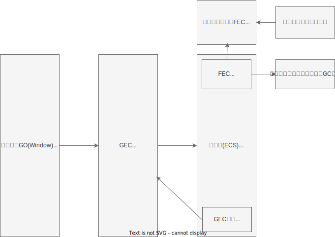

# 执行上下文 / 调用栈 / 作用域链

### 一. 执行上下文

定义：执行上下文是Javascript代码被解析和执行时所在的环境，里面存储了代码执行所需要的信息；

1. **执行上下文的类型**
- 全局执行上下文 - global EC
  * 代码开始执行前首先进入的环境。
  * 一个程序只有**一个**全局执行上下文。
  * 创建一个全局对象(浏览器中时Window，Node中时global)，将this指向这个全局对象。

- 函数执行上下文 - Function EC
  * 每当一个函数调用时都会创建一个新的FEC, 不限制个数。

- Eval执行上下文
  * 运行在 eval 函数内部的代码（开发中禁止使用，了解）。

2. **执行上下文的生命周期（重点：创建与销毁）**
执行上下文的生命周期分为两个阶段：创建阶段 和 执行阶段。
 - 创建阶段
 在代码真正执行之前，JS 引擎会先扫描一遍，做三件大事：
   1. 确定 this 的指向：
      * 全局环境：this -> window。
      * 函数环境：取决于函数如何被调用（普通调用、对象调用、new 调用、apply/call/bind）。

   2. 词法环境(LE)：
      * *核心结构*：{ 环境记录（Environment Record） + 外部环境引用（Outer Lexical Environment Reference） }；
      * *作用*：
         - 存储「let/const 声明、class 声明、import 变量、块级作用域变量」；
         - 外部环境引用实现作用域链（如闭包能访问外层变量）；
      * *特点*：
         - 有 “暂时性死区（TDZ）”，let/const 声明的变量在赋值前不可访问；
         - 块级作用域（如 if/for 块内的 let 变量）由 LE 的环境记录实现；

   3. 变量环境(VE)：
      * 作用：存储「var 声明、函数声明、函数参数」，保留 ES5 的变量提升特性；
      * 特点：和 ES5 中 VO 的 “变量提升部分” 逻辑一致，且始终是 “词法环境的一个实例”；
      * 举例：var a = 1 会存在 VE 中，提升到当前作用域顶部，初始值为 undefined。
 - 执行阶段。
   * 变量赋值。
   * 函数执行。 
   * 代码一行行运行。
 - 销毁阶段
   * 函数执行完毕后，它的执行上下文会被弹出栈，等待垃圾回收机制回收。
   * 注意：闭包会阻止这个销毁过程。

3. **GO / AO / VO / VE /LE**
   - GO：全局对象，属性VO对应GO，也是浏览器中的Window。
   - AO：函数执行上下文中对应的对象，VO对应AO（AO 是 VO 的 “执行阶段形态”，仅存在于函数执行上下文）。
   - VO: ES5中的概念，全局环境下VO对应GO，函数在执行阶段执行上下文的 VO 对应 AO;
   - VE: 变量环境，是 ES6 执行上下文的组成部分，ES6重构了执行上下文结构，将原 VO 拆分为 VE + LE；VE 存储的是「var 声明、函数声明、函数参数」，且保留变量提升特性，和 ES5 中 VO 的 “变量提升部分” 一致。
   - LE: 是ES6 执行上下文的核心组成（和 VE 并列），是 ES6 新增；LE 不仅存储 let/const，还存储「块级作用域变量、class 声明、import 导入的变量」，且 LE 有 “环境记录 + 外部环境引用” 的结构，是实现闭包和块级作用域的核心; LE 分为「声明式环境记录（用于块 / 函数）」和「对象式环境记录（用于全局）」，let/const 是其中一部分;

### 二. 调用栈

定义：调用栈是一个后进先出 (LIFO) 的数据结构，用于存储代码执行过程中所有处于运行状态的执行上下文。

1. **工作原理**
   - 当js开始执行前，会先创建全局执行上下文，并压入栈底。
   - 当遇到函数调用时，创建函数执行上下文，压入栈顶（后劲先出）。
   - js引擎从栈顶开始执行代码。
   - 当执行完一个函数后，执行上下文后弹出，继续执行栈顶下一个执行上下文。
2. **代码示例**
   ```js
    function foo() {
      console.log('foo');
      bar();
    }

    function bar() {
      console.log('bar');
    }

    foo();
   ```
   调用栈变化过程：
   1.global ec入栈。
   2.执行foo，foo ec入栈。
   3.执行console.log('foo')，内置函数入栈。
   4.console.log('foo')执行完毕出栈。
   5.执行bar函数，bar ec入栈。
   6.执行console.log('bar')，执行完毕出栈。
   7.bar函数执行完毕，bar ec出栈。
   8.foo函数执行完毕，foo ec出栈。
   9.程序结束，global ec出栈。

### 三. 作用域与作用域链

1. **作用域**
   **定义**： 变量和函数的可访问范围。
   - 词法作用域：js采用词法作用域，意味着变量和函数可访问范围是由**代码编写定义的位置**决定的。

2. **作用域链**
   **定义**：当查找一个变量时，js引擎会现在当前执行上下文中进行查找，如果找不到，就会去**父级**执行上下文查找，一致找到全局执行上下文，这种**链式查找关系**就是作用域链[每个执行上下文都有一个 [[Environment]] (外部环境引用) 属性，它指向了外层的执行上下文]。
   - 作用域链 = 当前执行上下文 + 所有父级执行上下文的变量对象。

### 四. 图形化理解

为了直观理解整个执行流程，绘制了对应的流程图：

