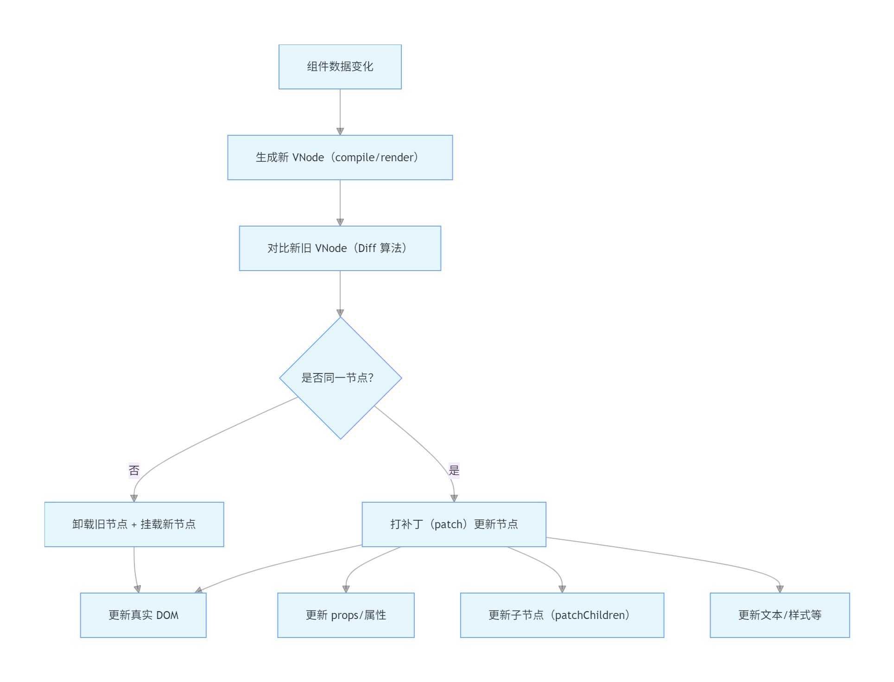

### 一、Vue3 虚拟 DOM（VNode）完整结构解析
虚拟 DOM（Virtual DOM，简称 VNode）本质是对真实 DOM 的 JavaScript 抽象描述，它是一个普通的 JS 对象，包含了渲染真实 DOM 所需的所有信息。Vue3 中 VNode 的结构比 Vue2 更精简，但核心字段更清晰，核心字段：
1. *VNode 核心结构（TypeScript 类型定义）*
```js
// 简化版 Vue3 VNode 类型
export interface VNode<HostNode = RendererNode, HostElement = RendererElement> {
  // 1. 核心标识与类型
  __v_isVNode: true; // 标记这是一个 VNode 对*象（避免和普通对象混淆）
  type: VNodeTypes;  // 节点类型（标签名/组件/文本/注释等）
  props: VNodeProps | null; // 节点属性（如 class、style、onClick 等）
  key: string | number | symbol | null; // 节点唯一标识（Diff 算法核心）
  
  // 2. 子节点相关
  children: VNodeNormalizedChildren; // 子节点（数组/文本/插槽等）
  shapeFlag: number; // 形状标识（位运算，快速判断节点类型，如是否是元素/文本/组件）
  patchFlag: number; // 补丁标识（标记节点需要更新的内容，如仅更新文本/类名/属性）
  
  // 3. 真实 DOM 关联
  el: HostNode | null; // 对应的真实 DOM 元素（VNode 和真实 DOM 双向绑定）
  anchor: HostNode | null; // 锚点节点（用于列表插入/移动时的定位）
  
  // 4. 组件相关（组件节点专属）
  component: ComponentInternalInstance | null; // 组件实例（仅组件 VNode 有）
  dirs: DirectiveBinding[] | null; // 指令（如 v-if/v-for/v-model）
}

// 辅助类型（简化）
type VNodeTypes = string | Component | Text | Comment | Static; // 节点类型枚举
type VNodeNormalizedChildren = string | VNodeArrayChildren | null; // 子节点类型
type VNodeArrayChildren = VNode[]; // 子 VNode 数组
```

2. 核心字段详解

| 字段 | 作用 | 举例子 |
|--------------- | ----------------| --------------- |
| type | 决定节点的「本质」，是 VNode 最核心的标识 | 元素节点：'div'；组件节点：MyComponent；文本节点：Symbol(Text) |
| props | 存储节点的属性 / 事件 / 指令等，是渲染真实 DOM 时需要设置的「属性集合」| { class: 'box', onClick: () => {}, style: { color: 'red' } } |
| key | 节点的唯一标识，Diff 算法通过 key 识别「同一个节点」，避免重复创建 | 列表渲染时：key="item.id" 或 key="index"（不推荐后者）|
| children | 存储子节点，文本节点是字符串，元素节点是 VNode 数组 | 文本子节点：'Hello Vue'；元素子节点：[h('span'), h('p')] |
| el | 指向该 VNode 对应的真实 DOM 元素，是「虚拟 → 真实」的桥梁 | 渲染后：el = document.createElement('div') |
| shapeFlag | 位运算标识，快速判断节点类型（性能优化） | 1 << 1 表示元素节点，1 << 2 表示文本节点，1 << 4 表示组件节点 |
| patchFlag | 标记节点需要更新的「范围」，避免全量对比（Vue3 核心优化） | 1 表示仅更新文本，2 表示仅更新类名，4 表示仅更新样式 |

3. 举个实际的 VNode 例子
比如你写了这段模板：
```js
<div class="container" @click="handleClick">
  <p>Hello {{ name }}</p>
</div>
```
编译后生成的 VNode 大致是这样（简化）：
```js
const vnode = {
  __v_isVNode: true,
  type: 'div',
  props: {
    class: 'container',
    onClick: handleClick
  },
  key: null,
  shapeFlag: 2, // 元素节点标识
  patchFlag: 0, // 无动态内容（div 本身是静态的）
  el: null, // 初始为 null，渲染后指向真实 div 元素
  children: [
    {
      __v_isVNode: true,
      type: 'p',
      props: null,
      key: null,
      shapeFlag: 2,
      patchFlag: 1, // 仅文本动态更新（{{ name }}）
      el: null,
      children: 'Hello ' + name // 文本子节点
    }
  ]
};
```

### 二、*Vue3 节点更新流程（从 VNode 到真实 DOM）*
Vue3 的节点更新流程核心是「生成新 VNode → 对比新旧 VNode（Diff）→ 打补丁（patch）到真实 DOM」，整个流程分为初始化渲染和更新渲染两个阶段，我会用「步骤 + 伪代码」的形式拆解：
*整体流程概览*


1. *阶段 1：初始化渲染（首次渲染）*
当组件第一次渲染时，没有旧 VNode，直接从 VNode 生成真实 DOM：
```js
// 初始化渲染核心逻辑（伪代码）
function mount(vnode, container) {
  const { type, props, children, shapeFlag } = vnode;
  
  // 步骤1：创建真实 DOM 元素
  if (shapeFlag & 2) { // 元素节点
    vnode.el = document.createElement(type); // 绑定 el 到 VNode
    // 步骤2：设置 props/属性（如 class、style、事件）
    if (props) {
      for (const key in props) {
        if (key.startsWith('on')) {
          // 处理事件（如 onClick → click）
          vnode.el.addEventListener(key.slice(2).toLowerCase(), props[key]);
        } else {
          // 处理普通属性（如 class、src）
          vnode.el.setAttribute(key, props[key]);
        }
      }
    }
    // 步骤3：处理子节点
    if (shapeFlag & 4) { // 有文本子节点
      vnode.el.textContent = children;
    } else if (Array.isArray(children)) { // 有子 VNode 数组
      children.forEach(child => mount(child, vnode.el)); // 递归挂载子节点
    }
  }
  
  // 步骤4：将真实 DOM 插入容器
  container.appendChild(vnode.el);
}
```

2. *阶段 2：更新渲染（数据变化后）*
当组件数据（如 name）变化时，Vue 会生成新 VNode，然后通过 patch 函数对比新旧 VNode，只更新需要变化的部分：
```js
// 更新渲染核心逻辑（伪代码）
function patch(n1, n2, container) {
  // n1: 旧 VNode，n2: 新 VNode
  
  // 步骤1：判断是否是同一个节点（key + type 必须相同）
  if (!isSameVNode(n1, n2)) {
    // 不是同一节点：卸载旧节点，挂载新节点
    unmount(n1); // 移除旧真实 DOM + 解绑事件
    mount(n2, container);
    return;
  }
  
  // 步骤2：绑定新 VNode 的 el 到旧 VNode 的 el（复用真实 DOM）
  n2.el = n1.el;
  const { type, props, children, patchFlag } = n2;
  
  // 步骤3：更新 props/属性（patchFlag 优化：只更动态部分）
  if (props || patchFlag) {
    patchProps(n1.props, n2.props, n2.el, patchFlag);
  }
  
  // 步骤4：更新子节点（核心 Diff 算法入口）
  patchChildren(n1, n2, n2.el);
}

// 子节点更新（包含 patchKeyedChildren 核心逻辑）
function patchChildren(n1, n2, container) {
  const c1 = n1.children; // 旧子节点
  const c2 = n2.children; // 新子节点
  
  // 情况1：新子节点是文本 → 直接替换
  if (typeof c2 === 'string') {
    container.textContent = c2;
  }
  // 情况2：新子节点是空 → 清空容器
  else if (c2 === null) {
    container.innerHTML = '';
  }
  // 情况3：新子节点是数组（列表）→ 执行 Diff 算法
  else if (Array.isArray(c2)) {
    if (Array.isArray(c1)) {
      // 新旧都是数组，且有 key → 执行 patchKeyedChildren（你之前学的 Diff 算法）
      patchKeyedChildren(c1, c2, container);
    } else {
      // 旧是文本/空，新是数组 → 清空后挂载新节点
      container.innerHTML = '';
      c2.forEach(child => mount(child, container));
    }
  }
}

// 辅助函数：判断是否同一节点
function isSameVNode(n1, n2) {
  return n1.key === n2.key && n1.type === n2.type;
}
```

3. *关键优化点（更新流程的核心性能保障）*
- patchFlag 精准更新：比如只有文本动态变化的节点，patch 时只更新 textContent，不碰其他属性；
- shapeFlag 快速判断：通过位运算（如 shapeFlag & 2）快速判断节点类型，避免多层 if-else；
- key 与 Diff 算法：列表更新时通过 key 识别相同节点，结合 LIS 最小化 DOM 移动；
- 复用真实 DOM：同一节点的 VNode 更新时，直接复用 el（真实 DOM），只更新变化的部分，不重新创建。

### 三、一个完整的更新例子（从数据变化到 DOM 更新）
假设你有一个组件：
```vue
<template>
  <div class="box" :style="{ color: color }">
    <p>{{ message }}</p>
    <ul>
      <li v-for="item in list" :key="item.id">{{ item.name }}</li>
    </ul>
  </div>
</template>

<script setup>
import { ref } from 'vue';
const color = ref('red');
const message = ref('Hello');
const list = ref([{ id: 1, name: 'A' }, { id: 2, name: 'B' }]);

// 触发更新
setTimeout(() => {
  message.value = 'Hello Vue'; // 文本更新
  color.value = 'blue'; // 样式更新
  list.value.push({ id: 3, name: 'C' }); // 列表新增
}, 1000);
</script>
```
更新流程拆解：
1. 1 秒后数据变化，Vue 触发组件重新渲染，生成新 VNode；
2. patch 函数对比新旧 VNode：
   - div 节点：key/type 相同 → 复用 el，只更新 style.color（patchFlag 标记仅样式更新）；
   - p 节点：key/type 相同 → 复用 el，只更新文本（patchFlag 标记仅文本更新）；
   - ul 节点：key/type 相同 → 执行 patchKeyedChildren：
     - 前置跳过 A、B 节点（key 相同）；
     - 发现新节点 C → 直接挂载到 ul 末尾（无需移动其他节点）；
3. 所有补丁更新完成，真实 DOM 同步变化，页面更新。

#### *总结*
1. *虚拟 DOM 结构*：核心是「描述真实 DOM 的 JS 对象」，包含 type（节点类型）、props（属性）、children（子节点）、el（关联真实 DOM）、key（Diff 标识）等字段，shapeFlag/patchFlag 是性能优化标识；
2. *节点更新流程*：分「初始化（mount）」和「更新（patch）」两个阶段，更新时先判断是否为同一节点，同一节点则复用真实 DOM，只更新变化的 props / 子节点，不同节点则直接替换；
3. *核心优化逻辑*：通过 patchFlag 精准更新、key + Diff 算法 最小化 DOM 移动、shapeFlag 快速判断节点类型，最终实现「最小化真实 DOM 操作」的目标。