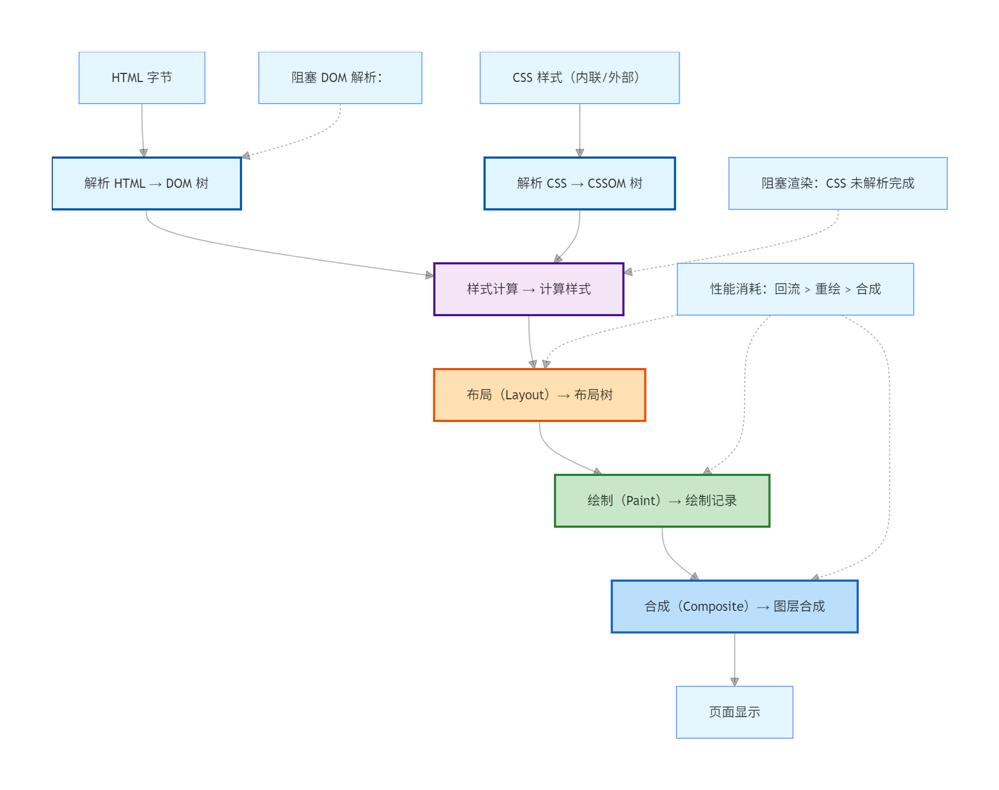
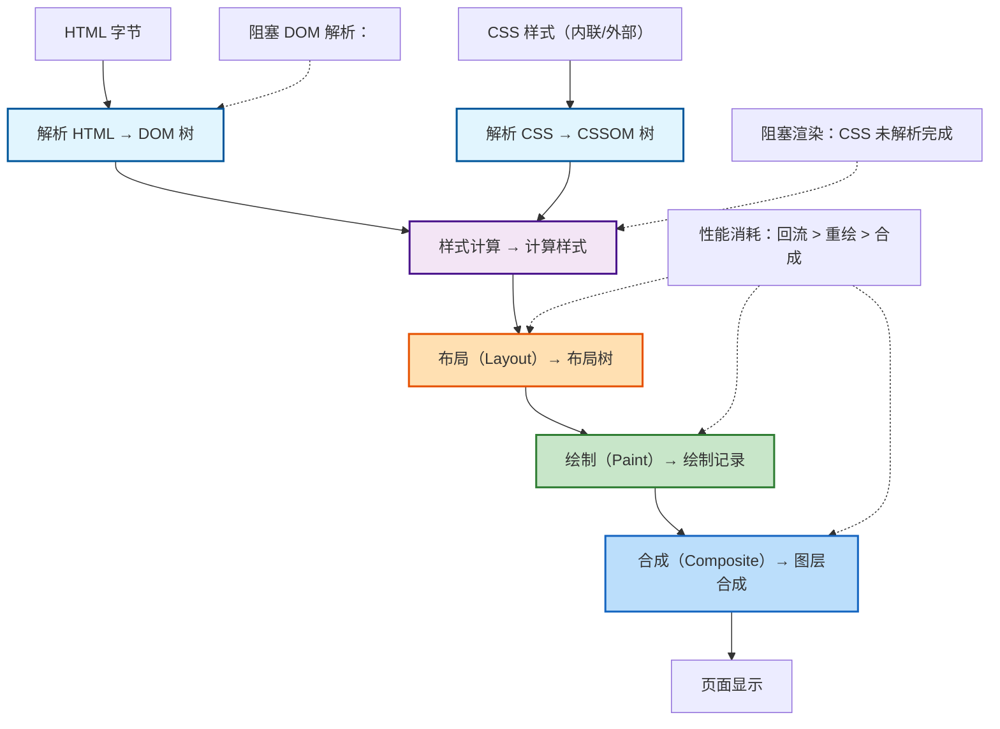

### 一、*浏览器渲染流水线核心逻辑*
浏览器从「接收 HTML 字节」到「页面显示」的全流程，核心分为 *5 个核心阶段 + 3 个关键优化点*，整体逻辑是：

`字节 → 结构化 → 样式化 → 布局 → 绘制 → 合成`

每个阶段的输出是下一个阶段的输入，且前序阶段修改会触发后续阶段重新执行（这是性能优化的关键）。

### 二、*渲染流水线全阶段拆解（附阶段标注）*

#### 1. *阶段 1：解析 HTML → DOM 树（Parse HTML → DOM Tree）*
- *输入*：网络层传输的 HTML 字节（二进制）；
- *处理*：
  1. 浏览器先将字节转换为字符（UTF-8 解码）；
  2. 词法分析：将字符拆分为「标签 / 属性 / 文本」等 Token（如 `<div>、class="box"`）；
  3. 语法分析：将 Token 组装为 DOM 节点，构建树形结构`（DOM Tree）`；
- *输出*：DOM 树（描述 HTML 结构，每个节点对应文档中的元素 / 文本）；
- *关键考点*：
  - 解析时遇到 `<script>` 会阻塞 DOM 解析（需等待脚本执行 / 加载），可通过 async/defer 优化；
  - 遇到 `<link rel="stylesheet">` 会阻塞渲染，但不阻塞 DOM 解析。

#### 2. *阶段 2：解析 CSS → CSSOM 树（Parse CSS → CSSOM Tree）*
- *输入*：内联 CSS、外部 CSS 文件、`<style> 标签中的样式；`
- *处理*：
  1. 同样经过「字节→字符→Token→节点」的解析过程；
  2. 解析 CSS 选择器、属性、值，构建 CSSOM 树（包含样式的继承、优先级规则）；
- *输出*：CSSOM 树（描述元素的样式规则，可计算每个 DOM 节点的最终样式）；
- *关键考点*：
  - CSSOM 构建是阻塞渲染的（需等待所有 CSS 解析完成，才能计算样式）；
  - CSS 选择器从右向左匹配（如  `box p` 先找所有 p，再筛选父级有 `.box` 的，这也是「避免复杂选择器」的原因）。

#### 3. 阶段 3：样式计算（Style Calculation）
- *输入*：DOM 树 + CSSOM 树；
- *处理*：
  1. 为每个 DOM 节点匹配 CSSOM 中的样式规则；
  2. 计算节点的「计算样式」（Computed Style），解决样式冲突（如优先级、继承）；
- *输出*：带计算样式的 DOM 节点；
- *关键考点*：
  - !important、行内样式、ID 选择器等优先级会影响计算结果；
  - 浏览器会缓存计算样式，仅修改样式时重新计算。

#### 4. 阶段 4：布局（Layout / Reflow）
- *输入*：带计算样式的 DOM 树；
- *处理*：
  1. 计算每个节点的几何信息：位置（x/y）、尺寸（width/height）、盒模型；
  2. 构建布局树（Layout Tree），仅包含「可见节点」（隐藏节点如 display: none 会被排除）；
- *输出*：布局树（描述可见节点的几何位置）；
- *关键考点*：
  - 布局是「流」式的，一个节点的布局变化会触发父 / 子 / 兄弟节点的重新布局（回流）；
  - 触发回流的操作：修改尺寸（width/height）、位置（top/left）、DOM 增删、窗口.resize 等。

#### 5. 阶段 5：绘制（Paint）
- *输入*：布局树；
- *处理*：
  1. 将布局树转换为「绘制记录」（Paint Records），记录绘制顺序（如先画背景、再画文本、最后画边框）；
  2. 浏览器将绘制记录提交给 GPU，绘制到图层上；
- *输出*：像素信息（未显示到屏幕）；
- *关键考点*：
  - 触发重绘的操作：修改颜色（color）、背景（background）、阴影（box-shadow）等不影响布局的样式；
  - 重绘比回流性能消耗小，但仍需避免频繁触发。

#### 6. 阶段 6：合成（Composite）
- *输入*：各图层的像素信息；
- *处理*：
  1. 浏览器将页面划分为多个图层（如 transform/opacity 会创建独立图层）；
  2. GPU 对各图层进行合成，最终输出到屏幕；
- *输出*：可见的页面；
- *关键考点*：
  - 合成阶段是性能最优的，修改 transform/opacity 仅触发合成，不触发回流 / 重绘；
  - 合理使用图层（如 will-change: transform）可减少性能消耗。

### 三、渲染流水线可视化图表
1. Mermaid 流程图 



2. 阶段性能消耗对比表

| 阶段 | 性能消耗 | 触发操作示例 | 优化建议 |
| ----------- | ----------- | ----------- | ----------- |
| 回流（Layout）| 最高 | 修改 width/height、DOM 增删、resize | 1. 批量修改样式 2. 脱离文档流修改（position:absolute/fixed）3. 使用 requestAnimationFrame |
| 重绘（Paint） | 中等 | 修改 color、background、box-shadow | 1. 避免频繁修改可视样式 2. 合并样式修改 |
| 合成（Composite） | 最低 | 修改 transform、opacity | 优先使用这两个属性实现动画 |

### 四、 总结文档

```markdown
# 浏览器渲染流水线全解析
## 一、核心流程
浏览器渲染页面的核心流水线：  
`HTML 解析 → CSS 解析 → 样式计算 → 布局 → 绘制 → 合成 → 页面显示`

## 二、各阶段详细说明
### 1. 解析 HTML → DOM 树
- 输入：HTML 字节（二进制）；
- 输出：DOM 树（描述 HTML 结构）；
- 关键：`<script>` 无 `async/defer` 会阻塞 DOM 解析。

### 2. 解析 CSS → CSSOM 树
- 输入：所有 CSS 样式（内联/外部）；
- 输出：CSSOM 树（描述样式规则）；
- 关键：CSSOM 构建阻塞渲染，需优先加载关键 CSS。

### 3. 样式计算
- 输入：DOM 树 + CSSOM 树；
- 输出：带计算样式的 DOM 节点；
- 关键：解决样式优先级/继承冲突，计算最终样式。

### 4. 布局（Layout/Reflow）
- 输入：带计算样式的 DOM 节点；
- 输出：布局树（可见节点的几何信息）；
- 关键：回流消耗最高，避免频繁修改布局属性。

### 5. 绘制（Paint）
- 输入：布局树；
- 输出：绘制记录（像素信息）；
- 关键：重绘仅修改视觉样式，不影响布局。

### 6. 合成（Composite）
- 输入：各图层像素信息；
- 输出：最终页面；
- 关键：`transform/opacity` 仅触发合成，是动画最优选择。

## 三、性能优化核心原则
1. 减少阻塞：
   - 脚本用 `async/defer` 避免阻塞 DOM 解析；
   - 提取关键 CSS 内联，避免 CSS 阻塞渲染。
2. 减少回流/重绘：
   - 批量修改样式（如通过 class 切换）；
   - 脱离文档流修改元素（position:absolute/fixed）；
   - 避免频繁读取布局属性（如 offsetTop，会触发强制同步布局）。
3. 优先使用合成层：
   - 动画用 `transform/opacity`；
   - 复杂元素用 `will-change: transform` 创建独立图层。

## 四、渲染流水线图


### 总结
1. 浏览器渲染流水线的核心是「从结构化到可视化」的递进过程，每个阶段的输出是下一个阶段的输入；
2. 性能优化的关键是「减少阻塞」和「避免高频回流/重绘」，优先使用合成层属性（transform/opacity）；